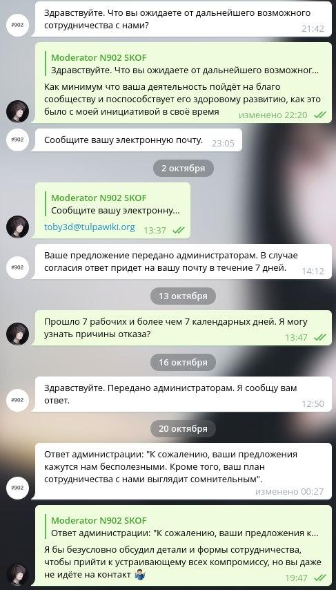
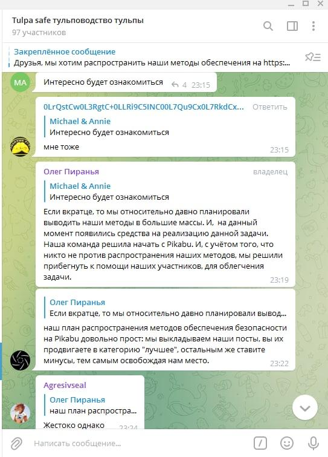
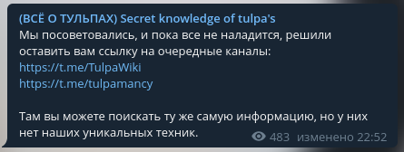

Некоторое время назад, группа независимых команд исследователей тульп S.K.O.F.,
считающие себя экспертами и первопроходцами, объявились в каналах TulpaWiki с
целью рекламы продаж доступа к собственным закрытым площадкам. А ввиду отсутствия
каких-либо ссылок, профилей представителей и иной информации вроде архивов
упоминаемого ими форума, я склонен предположить что это либо перформанс, либо
троллинг, либо что-то значительно хуже.

<!--more-->

Конкретно TulpaWiki никогда не задумывался как что-то требующее пэйвола, СМС и
регистрации. На страницах никогда не было рекламы, потому что [реклама - сосёт](https://toby3d.me/ru/ads/).
Редкие предложения продать всё с потрохами также не имеют смысла. Для абсолютной
прозрачности с недавнего времени [исходный код вики](https://gitlab.com/TulpaWiki/tulpawiki.gitlab.io)
был полностью открыт любому желающему. Чтобы не терять самое ценное что в ней
есть - [архив гайдов](https://gitlab.com/TulpaWiki/archive) был также опубликован.
Всё это было, есть и останется бесплатным навсегда. Без исключений.

И, на самом деле, я не вижу ничего плохого в том чтобы кто-то попытался грамотно
монетизировать что-нибудь полезное для тульповодов. Конкуренция это, как минимум,
полезно. Как максимум -- весело. А раз цели общие, то я бы с радостью предложил
свою помощь и ресурсы.

Более того, я так и сделал:

Но чем чаще эти ребята имитировали бурную деятельность, тем очевиднее становилась
их инфоцыганская основа. С недавнего времени, S.K.O.F., считающие себя экспертами
и первопроходцами, начали заниматься откровенным SCAM-ом. Они заручились
аудиторией в виде ботов, дублировали [нашу площадку в Telegram](https://t.me/TulpaWiki)
и [команду модерации](copycat.png) в ней с целью фишинга и пытаются давить
конкурентов сомнительными «операциями» на Пикабу:

Выдача себя за «представителей» TulpaWiki в фишинговом чате это отдельная смешная
шутка. Это не СМИ, не ИП, ни компания или организация. TulpaWiki - проект, над
которым работают множество разных людей с одинаковой отвественностью. И Telegram
[никогда не задумывался быть единственно верным источником](https://indieweb.org/silo).

Подобными методами честные люди обычно не пользуются. Коллективы, которые
радикально огораживаются, вешают ярлыки "токсичных" на всех подряд и
самоутверждаются засчёт давления на других обычно долго не работают.

К тому же, те советы что были ими опубликованы не только бесполезны -- они
вредны. О каком взаимном доверии хоста и тульпы можно говорить, когда
пропагандируется использование «стоп-слова»? Речь точно об здоровых
взаимоотношениях, а не о тамагочи с которым можно наиграться и сбросить? Надо ли
говорить что попытки форсить с шатким фундаментом в виде цели "если что дропнуть"
обречены на провал?

## P.S.

Раз S.K.O.F., считающие себя экспертами и первопроходцами, однозначно показали
себя мошенниками, то и наши действия отныне будут соотвествующими. Мы уже
проинформировали Пикабу о вас, не благодарите.

По их словам (со ссылкой сюда):

> ...вы можете поискать *ту же самую информацию*, но у них нет наших уникальных
> техник.

Действительно, здесь нет «уникальных техник». Потому что их также нет и у вас.

Ну и зачем тогда платить за то что доступно бесплатно?

[Не нужно отвечать](https://www.youtube.com/watch?v=Wx2kl_HgRPw),
[это риторический вопрос](https://www.youtube.com/watch?v=890NnPxJDFA).

Есть возражения? Что ж, мы [всегда можем всё обсудить](mailto:toby3d@tulpawiki.org).
