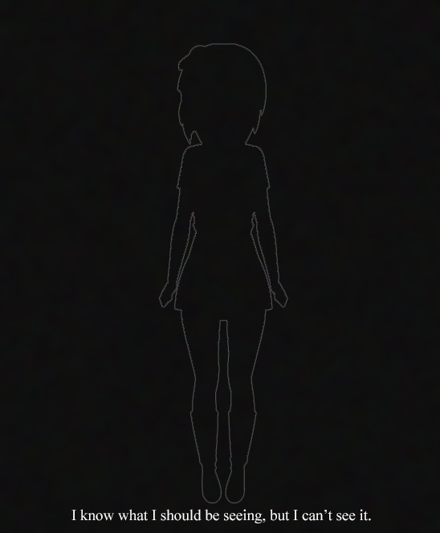
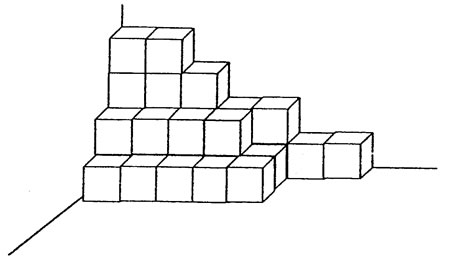
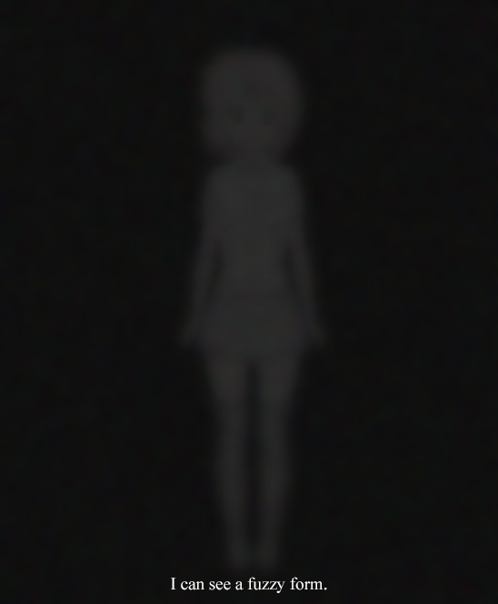
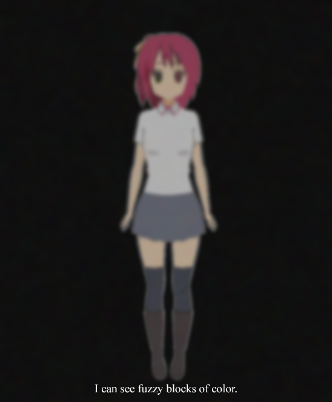
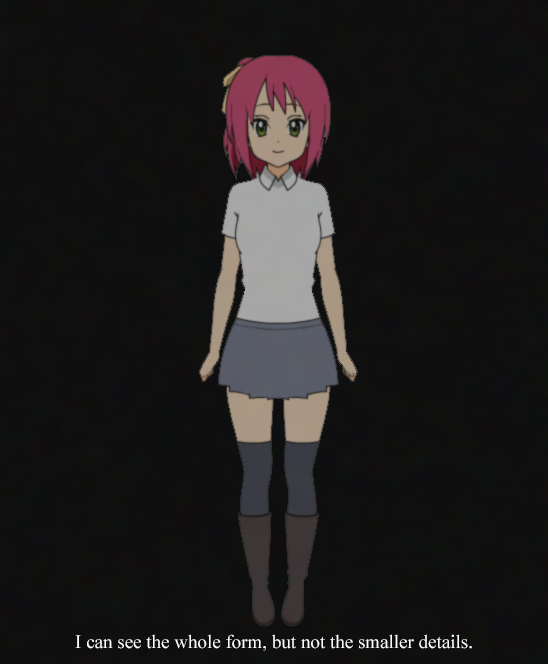
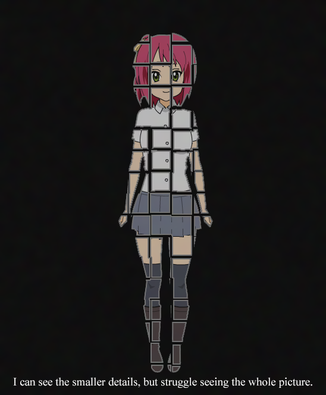
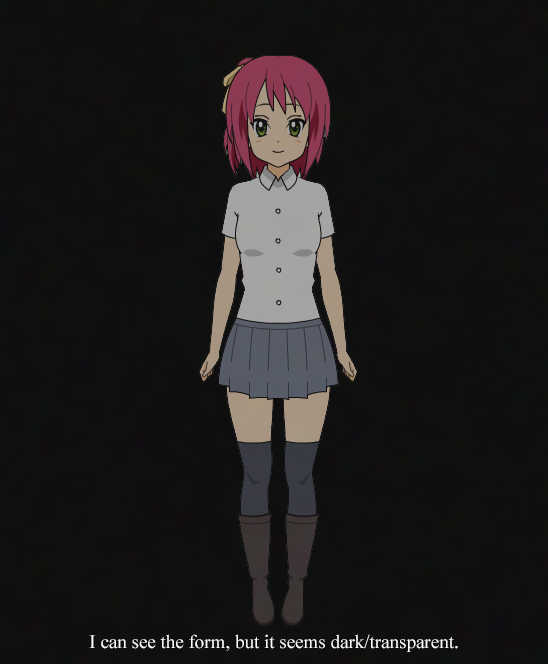
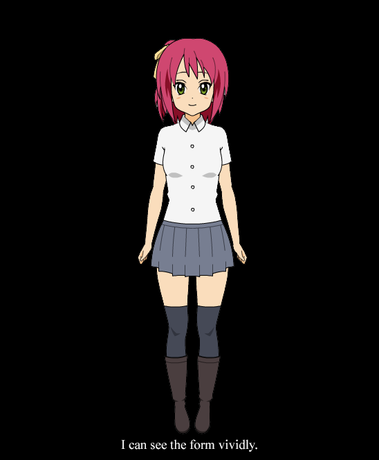

 
Способности к визуализации у людей, приходящих в тульповодство, различны. Зачастую люди с художественными способностями или с хорошим воображением могут отлично визуализировать. Однако, некоторые испытывают с этим трудности, вплоть до полной неспособности к визуализации. Цель этого гайда — оценить ваш уровень навыка визуализации и показать, как его можно улучшить.

## Я знаю, что я должен видеть, но не вижу

Если вы находитесь на этом уровне визуализации, то, вероятнее всего, проблема в том, что вы ожидаете увидеть тульпу глазами или увидеть её изображение на внутренней стороне век. Однако, это так не работает. Визуализация затрагивает внутренний взор, который отделён от потока данных, передаваемых глазами в мозг. Вы должны сконцентрироваться на переводе своего внимания с физических глаз на мыленный взор. Вы, как правило, постоянно используете мысленный взор, особенно для держания в уме окружающей обстановки. В качестве примера, посмотрите на эту постройку из кубиков:

Когда вы будете считать, сколько кубиков в этой конструкции, вы, вероятно, будете учитывать не только те кубики, которые вы видите глазами, но и спрятанные кубики, которые вы можете видеть мысленным взором (это чем-то похоже на мысленное рентгеновское зрение). На этом изображении 19 видимых кубиков и 12 скрытых.

## Я вижу размытую форму

На этом уровне визуализации вы уже используете мысленный взор, но пока ещё не достигли чёткости и красочности образа. Преодоление этого этапа целиком зависит от практики. Вам может помочь одно упражнение, являющееся моей лёгкой модификацией [гайда по визуализации чисел Rasznir’а](https://community.tulpa.info/thread-visualization-visualization-focus-guide). Суть его заключается в том, что вы визуализируете альбом у себя в голове и просите тульпу последовательно рисовать числа от 0 до 100 на каждой странице этого альбома. Пытайтесь детально визуализировать вашу тульпу, пишущую числа, не отвлекаясь. Если вы потеряете фокус, начинайте заново с нуля. Я советую, также, чтобы ваша тульпа рисовала эти числа разными цветами, а вы пытались назвать цвет, который она использовала. Если вы назвали его правильно, переходите к следующему числу. Если нет, то начинайте заново. Суть в том, чтобы ваша тульпа проверяла, насколько правильно вы визуализируете цвета.

## Я вижу размытые цветные пятна

На этом этапе вы уже освоили основы, но образы пока что выглядят смутными, как не до конца запомненный сон. Чтобы продвинуться дальше, вы должны сосредоточиться на нескольких вещах. Первое, вы должны начать визуализировать более мелкие детали. Начните с внимательного изученя вашей тульпы, от головы до пят; последовательно изучайте мелкие детали тульпы, как если бы вы её рассматривали через Google Maps. Кроме того, вам нужно развить способность знать, в какой точной позе находится в данный момент ваша тульпа. Размытость может свидетельствовать о неоднозначности визуализации, и замена неопределённости конкретными представлениями поможет уменьшить расплывчатость образов. Чтобы развить эту способность, попробуйте играть в основанную на геометрических формах игру, такую как тетерис, от часа в день. В конечном счёте ваш мозг станет хорошо представлять точную форму геометрической головоломки, что, применительно к тульпе, уменьшит смутность образа.

## Я вижу цельную форму, но без мелких деталей

На этом этапе вы, если хотите, уже можете перейти к наслоению тульпы, но чтобы сделать её действительно реалистичной, вам нужно усовершенствовать ваши навыки визуализации. Для прохождения этого этапа вам может пригодиться одно упражнение, вдохновлённое Google Maps. Выберите любую локацию в режиме вида со спутника в таком увеличении, чтобы вы не могли различить отдельные здания. Некоторое время запоминайте подробности этого вида. Когда вы сможете ясно визуализировать его у себя в голове, приблизьте немого и изучите более мелкие детали, которые ранее были вам недоступны. Рассматривайте кортину и визуализируйте её. Когда это у вас получится, приблизьте ещё и повторите. И ещё. Цель в том, чтобы вы могли мысленно реконструировать эту карту и как угодно приближать и отдалять её. Это упражнение может показаться сложноватым, поэтому начните с небольших участков и приближайте их только один или два раза. Со временем вы научитесь визуализировать мелкие детли бóльших картин. Кроме того, вы можете заняться формой вашей тульпы и изучить её в мельчайших подробностях, как вы уже это сделали с картой.

## Я вижу мелкие детали, но не вижу всю картину

Не так часто, но всё же случается, когда вы можете видеть отдельные детали вашей тульпы, но вам сложно увидеть её целиком, тульпа похожа на коллаж из отдельных её частей. Самый простой способ справиться с этой проблемой — визуализировать тульпу с различных расстояний. Визуализируйте ей на большом расстоянии от себя, чтобы увидеть всё её тело вместо отдельных фрагментов. Попросите её идти к вам, пока у вас опять не возникнут проблемы с видением её целиком. Так вы обнаружите порог визуализации всего тела. Чтобы сдвинуть этот порог, просто какое-то время визуализируйте всю тульпу от макушки до пяток с этого расстояния, пока коллаж не начнёт складываться в единую картинку. Чистая практика — самый простой найденный мной способ решения этой проблемы.

## Я вижу всю форму, но она кажется тёмной/прозрачной

Вы уже почти профессионал в визуализации, последний этап заключается в преодолении ментального барьера, который делает визуализируемые образы прозрачными или зловеще тёмными. После преодоления этого этапа вы будете полностью готовы к наслоению. Хотя даже обычные тренировки визуализации со временем решат эту проблему, её также можно разрешить посредством медитации и осмысления того, как вы вообще видите что-либо. 

Ваши физические глаза отправляют зрительные данные в мозг, который формирует из них изображение. По сути, вы видите мозгом, а не глазами. То, что вы визуализируете, также обрабатывается мозгом. Вы должны убедить себя, что не существует никакой разницы между тем, что вы видите глазами, и тем, что вы ментально визуализируете, поскольку в конечном итоге всё изображение формируется мозгом. Воспринимаемый вами образ мира полностью зависит от вашей сознательной воли. Любой физический объект, который вы видите, построен исключительно вашим мозгом. Ваши глаза просто реагируют на отражённые от объекта фотоны, а уже мозг решает транслировать их в цвета и формы. Аналогично и для ментальных объектов, с той лишь разницей, что процесс не зависит от физического мира. Ваш мозг может транслировать ваше воображение в цвета и формы точно таким же образом. Если вы сможете помедитировать на эти мысли, возможно, вы тоже осознаете, насколько субъективна реальность. И когда вы это сделаете, уровень вашего навыка визуализации достигнет ярчайшего качества.

## Я отчётливо вижу форму тульпы

Поздравляю. Ваша визуализация восхитительна, вы полностью готовы перейти к наслоению. Если вы этого ещё не сделали, попробуйте визуализировать тульпу с открытыми глазами и сравните качество с тем, что было при закрытых глазах. Упражнения для открытоглазой визуализации в точности те же, что и для закрытоглазой.

Если вы смогли достигнуть определённого качества визуализации, но оно возникает только на короткое время и отступает до более низкого уровня, вам следует попробовать тренировать визуализации более низкого уровня, чем вы пытаетесь сейчас.

## Ссылки

  * [Источник](https://community.tulpa.info/thread-visualization-jd-s-guide-to-visualization)

