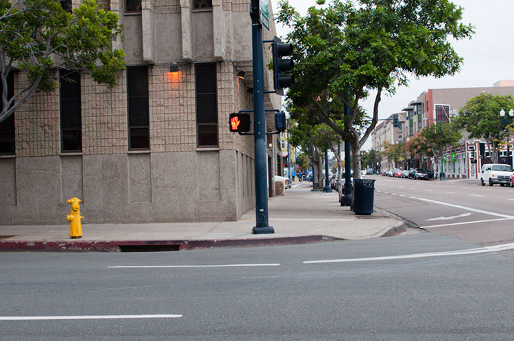

После того, как я почитал пару блогов и поговорил с несколькими тульповодами в IRC, я обнаружил, что многие просто не могут представить тульпу целиком. Они могут представить только  часть тела, лицо, торс или ноги. В художественной школе я выучил одно упражнение, которое помогает научиться визуализировать цельное изображение без забывания подробностей, искажения пропорций или перепутывания деталей.

Взгляните на изображение выше и внимательно рассмотрите светофорный столб с запрещающим сигналом на нём. Вы должны внимательнейшим образом его изучить. Обратите внимание на пятно на символе руки. На болты и на всё остальное. А теперь около 10 минут с закрытыми глазами думайте об этом столбе. Только об этом столбе. Выкиньте из головы все остальные мысли, о том как прошёл ваш день и подобное. Ничего страшного не случится, если вы начнёте говорить про себя об этом столбе. Я так делал. "Этот столб высокий и тёмный. Я вижу красную ладонь и черноту рядом с ней". Вы должны фокусироваться на нём примерно 5 раз в среднем по 10 минут. Рассматривайте фото между упражнениями. Этот процесс должен занять у вас день или два. Вы можете попробовать пройти этот первый шаг за час или за полдня. Это не сработает. Я не знаю почему, это просто не работает. 

Теперь, когда вы завершили первый шаг — запомнили светофорный столб с красным сигналом — начните изучать тротуар. Только тротуар, не обращайте внимания на деревья, мусорку и другие предметы на нём. Изучите каждую деталь тротуара. Этот процесс займёт у вас гораздо, гораздо больше времени, чем первый шаг. Теперь закройте глаза и делайте то же, что и со столбом, но на этот раз помимо него визуализируйте ещё и тротуар. Держите в уме оба объекта с максимально возможным числом деталей. У вас возникнут трудности с фокусированием на мелких деталях, таких как облупившаяся краска на бордюре или болты на столбе. Фокусируйтесь и визуализируйте. Это займёт у вас гораздо больше, чем 5 или 10 минут. Тратьте как минимум от 15 до 20 минут каждый раз. На этот раз вместо того, чтобы делать это X раз, вы должны повторять упражнение пока не сможете полностью представить тротуар и светофорный столб. Этот шаг займёт у вас от трёх дней до целой недели. Не сдавайтесь! Это упражнение может быть гораздо полезней, чем просто визуализация тульпы.

А теперь повторяйте то же самое для всего фото, каждый раз добавляя всё больше и больше деталей. В конечном счёте вы с лёгкостью сможеет визуализировать всё изображение. На это первое фото у вас может уйти вплоть до двух или трёх месяцев. Это нормально. После этого найдите новое фото и проделайте с ним то же самое. Вам будет намного проще, чем с первым. Ваш мозг уже научится изучать и визуализировать несколько предметов за раз. Вы не только сможете лучше представлять объекты, но и ваша визуальная память возрастёт экспоненциально.

* [Источник](https://community.tulpa.info/thread-visualization-mental-image-rendering-guide)
