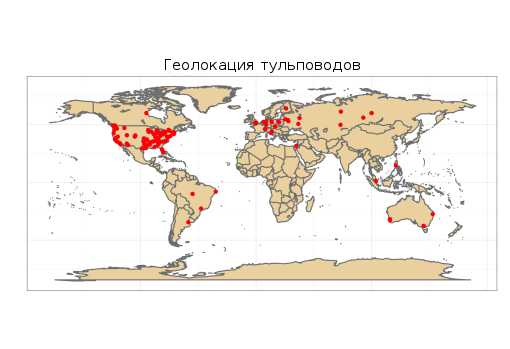

**Многообразие феномена тульпы: разумные воображаемые друзья, воплощённое совместное внимание, гипнотические черты общества в информационном мире**

_2015-04-03 16:30:22_

_By Samuel Veissière_

## Аннотация

В этой статье рассмотрены основные выводы десятимесячного этнографического исследования тульповодов, проведённого в Интернете. Тульпа (термин заимствован из тибетского буддизма) — это воображаемый компаньон, которого можно наделить полностью самостоятельным сознанием путём определённых медитативных практик. Тульповоды или "хосты" — люди, которые занимаются этим, основываясь на гайдах и обсуждених на Интернет-форумах — воспринимают своих тульп как полупостоянные слуховые и соматические галлюцинации.

Изучение хостов и тульп интересно по многим причинам, не в последнюю очередь из-за того, что это даёт возможность наблюдать за зарождающейся культурой и появлением нового типа людей — у которых несколько личностией "хостятся" в одном теле; также имеются данные о положительном социокультурном влиянии, достигаемом без физического взаимодействия между членами сообщества. Меня, как антрополога, изучавшего также когнитивные науки, однако, меньше всего волнует кажущаяся "странность" и "экзотичность" тульповодства. Мой интерес вызывает то то, что это явление может прояснить некоторые фундаментальные аспекты устройства человека. Также я стремлюсь исследовать то, как повествовательные и нейрокогнитивные процессы, а также процессы, относящиеся к вниманию, формируют личность и все формы социальности; а кроме того, как социальные, политические и технологические процессы формируют механизмы внимания, познания и восприятия. Я склоняюсь к социокогнитивным, энактивистским моделям гипноза как к промежуточному звену между социальностью и индивидуальностью.

Моё исследование базируется на изучении взаимодействия между окружающей средой, познанием и культурой. В этой модели разум понимается как встроенный, воплощённый (Kirmayer, 1992a; Csordas & Masquelier, 1997), энактивный (Varela, Thompson & Rosch, 1991) и распространяющийся за пределы организма (Clark & Chalmers, 1998), в окружающую среду. Как изящно выразился [Эван Томпсон](http://www.upaya.org/2015/03/evan-thompson-02-06-2015-zen-brain-the-embedded-mind-perspectives-from-buddhism-and-cognitive-science-part-2/), полёт птицы является не неотъемлемым свойством её крыльев, а следсвием взаимодействия организма с окружающей средой; так и мышление не находится "внутри" мозга, но является продуктом взаимодействия чувств и окружающей среды (Thompson, 2015; Bateson, 1972; 1980). В этой работе я использую рабочее определение "культуры", позаимствованное из естественных наук: мы можем говорить о _культуре_, когда группы индивидов близких видов участвуют в кумулятивном социальном обучении и вырабатывают относительно _устойчивые_ методы выполнения определённых действий, отличающиеся от таковых в других группах(см. [Tomasello](http://mitpress.mit.edu/books/why-we-cooperate), 2009). Кроме того, я включаю _сенсорные ощущения_, _режимы аффектов_, _совместное внимание_ и _гипноз_ в множество кумулятивных, повторяющихся, дифференцированных явлений, возникающих посредством социального обучения и дающих нам то, что мы называем "культурой".

Перед тем, как погрузиться в детальное изучение тульповодства, я хочу озвучить старый вопрос: как могут очень похожие представления, переживания и формы поведения распространятся среди большого количества людей, никогда не встречавшихся друг с другом лично? Существуют ли какие-либо фундаментальные различия между онлайн сообществами и "физическими", или же это принципиально схожие явления?

## 1. Язык незримости и незримость языка

_Порой люди мучаются от угрызений совести[…] и они хотят иметь какие-то критерии "реальности" вещей. К примеру, считают реальными только объекты, занимающие место. И тогда они могут сказать что-то навроде "границы — это воображаемые линии". Они, видимо, считают, что страны, занимающие территории, реальны, но разделяющие их линии — воображаемы._

_Мудрый Кубла-хан, тебе известно лучше, чем кому-либо другому, что не следует путать город с его словесным описанием._

_– Образы памяти, однажды высказанные словами, стираются, – сказал Поло. – И, может быть, я опасаюсь утратить всю Венецию сразу, если заговорю о ней. А может быть, говоря о других городах, я ее уже постепенно утратил._

"Мне кажется, Интернет чем-то похож на город", — сказал мне однажды утром за третьей чашкой двойного эспрессо [Ян Голд](http://ian-gold.com/). Ян — профессор психиатрии, в настоящий момент изучающий, почему среди мигрантов, живущих поодиночку и небольшими группами в городах, психозы встречаются чаще, чем у них на родине. Дискриминация, жестокость, стигматизация и нестабильность государства всё чаще воспринимаются как важные факторы развития психических заболеваний[( [Heinz, Deserno, & Reinighaus, 2013](http://onlinelibrary.wiley.com/doi/10.1002/wps.20056/abstract) )], но до сих пор не понятно, _как_ такие различные тенденции распространились с такими суровыми постоянством и точностью. Крупные города, как "сообщества", достаточно сложны, для того, чтобы ими управлять. "Город. Что это за воображаемое сообщество, — продолжил Ян, — в котором большинство людей вращаются в очень ограниченных кругах: дом, работа и обезличенное взаимодействие с незнакомцами и кассирами в магазинах?"

Это старый вопрос: как общество может быть понятным, "усваиваемым" или воплощённым, когда большая часть его инфраструктур, образующих его людей и мнений, остаётся невидимой для отдельных его членов? Можно предположить, что, учитывая нефизический характер взаимодействия между их членами, города и общества подобны Интернету. Незримость и физическое взаимодействие, таким образом, являются важными деталями этой головоломки.

Эрвинг Гоффман, занимавшийся изучением личного взаимодействия в условиях современного общества, объясняет _обезличенный, поверхностый характер_ жизни в городах тем, что он назвал "[городским безразличием](http://www.everydaysociologyblog.com/2011/12/encountering-strangers-in-public-places-goffman-and-civil-inattention.html)"[(civil inattention)][(Goffman, 1971, p385)], явлением, описывающим, почему незнакомцы отводят взгляд, избегают разговоров и физических контактов и постоянно укрепляют свои личные границы. Одиночество и скрытность, как заметил Гоффман, логически проистекают из городского безразличия[(ibid, p359)]. Как теоретик-социолог, я особенно заинтересован в том, как различные типы совместного внимания влияют на переживаемый личностью сенсорный, соматический, "воплощённый" опыт. Городское безразличие, к примеру, это особый тип внимания, который, однако, не является _отсутствием_ внимания. В Незримом Городе Гоффмана ресурсы внимания устроены таким образом, чтобы _не_ замечать определённые свойства мира — к примеру, людей, учавствующих в так называемых иерархических играх. Для тех, кто пришёл к такому безразличию, своя незримость становится _физически_ невыносима. Это ужасная проблема, но общий вопрос остаётся тем же: принимая во внимание крайне ограниченную возможность социального взаимодействия между членами любого города, как она могла появиться, учитывая такие явно предсказуемые последствия? Какое _минимальное_ физическое взаимодействие требуется для существования любой системы или города — для любого воображаемого сообщества? Каковы _максимальные_ пространственные и когнитивные возможности совместного внимания — обычно понимающегося как возможного только между двумя субъектами или ограниченного в пространстве? Быть может, Кальвино неправильно понял Город в своём анти-репрезентационалистском произведении? Возможно, язык не только не может разрушить город, но вместо этого рождает его на свет?

Стивен Левинсон из [Института Психолингвистки имени Макса Планка](http://www.mpi.nl/) серьёзно занялся этой гипотезой и провёл ряд интересных экспериментов, чтобы прояснить понимание теории лингвистической относительности, которая была впервые предложена Бенджамином Уорфом в начале 20-го столетия и впоследствии отвергнута большинством учёных. В своём экспериментальном исследовании _[Senses in Language and Culture
](https://www.researchgate.net/application.ClientValidation.html?origPath=/profile/Stephen_Levinson/publication/233671403_The_Senses_in_Language_and_Culture/links/00463531f7cd6237e3000000.pdf)_, Левинсон и его коллеги исследовали различные культуры в попытке выявить связь богатства и разнообразия сенсорного опыта с грамматическими категориями и определёнными терминами, относящимися к сенсориуму в разных языках. Они обнаружили, что носители языков (например, американского английского) со скудной палитрой слов, связанных, к примеру, с обонянием и запахами, довольно плохо распознают запахи, распространённые в их культурах (навроде корицы). Джахаец с Малаккского полуострова, напротив, имеет богатый словарный запас "обонятельных" слов и может различать большое количество запахов.

Быть может, погружение в новые практики, называемые "тульпофорсингом", "посессингом" или "вондерлендом", распространившиеся благодаря Интернету, является достаточным условием для переживания новых тактильных и слуховых ощущений, получения удовольствия и развития синестезии, если назвать хотя бы некоторые черты, присущие тульповодству?

## 2. Многообразие опыта тульповодства

Термин "тульпа" появился в западной культуре в 1929 году, благодаря книге «Магия и тайна Тибета» _(Mystiques et magiciens du Tibet)_ бельгийско-французской исследовательницы Александры Давид-Неэль. Автор, изучавшая эту практику в Тибете, утверждала, что создала тульпу. Этот термин, часто транскрибируемый как [sprul pa’i sku](https://collab.itc.virginia.edu/wiki/renaissanceold/sprul%20pa'i%20sku.html), от тибетского སྤྲུལ་པ, можно перевести как "эманация" или "воплощение ", связанное с физическим телом (_Nirmanakaya_). В настоящий момент в тульповодском сообществе под _тульпой_ понимается разумное существо, воплощённое как мыслеформа.

### Тульпы и ощущения

Большинство тульповодов, как правило, молодые евроамериканцы, живущие в городах и относящиеся к среднему классу; они называют одиночество и социофобию основными стимулами, подтолкнувшими их к этой практике и сообщают о чрезвычайных положительных изменениях в социальной жизни, помимо огромной гаммы нового, "необычного", но по большей части приятного, опыта. Этот опыт включает в себя (по убыванию частоты) слуховые, тактильные, зрительные и обонятельные ощущения. Также сообщается о других формах взаимодействия с тульпами, невербальных и не связанных с мысленным голосом, таких как "сырые мысли", "подсознательные мысли", "разговоры без слов" и "общение образами, чувствами и музыкой". Одна респондентка, молодая женщина, американка кавказского происхождения, обучающаяся когнитивным наукам в Среднезападном Университете[(Midwestern University)], рассказала следующее. Однажды утром она легко оделась и, пока шла на занятия, замёрзла. Тогда её тульпа сняла своё (тульпы) пальто и накинула на её (хоста) плечи, после чего она (хост) почувствовала тепло и ясно ощутила присутствие дополнительного слоя одежды. Подобных сообщений о спонтанной помощи тульп в повседневных, социальных и профессиональных ситуацих предостаточно.

Мнение сообщества о сексуальных и романтических отношениях с тульпами противоречиво, однако прослеживается тенденция к табуированию таких отношений. Поскольку тульпы считаются разумными существами со своими мыслями, чувствами, предубеждениями и предпочтениями, становится критически важным вопрос взаимного согласия. В связи с этим, создание тульпы для получения эгоистичного удовольствия воспринимается как неэтичный поступок, как поиск односторонних, несбалансированых отношений. Присущая тульповодству возможность испытывания тактильных и других ощущений, однако, свидетельствует о том, что это _табу_ было введено, чтобы ограничить распространённую или, как минимум, вероятную практику. 

В дополнение к воображаемым агентам, тульповодческие ментальные конструкции включают в себя пространство для взаимодействия хоста и тульпы, обычно называемое "вондерлендом". Часто тульпы принимают человеческую форму, однако нередки формы разнообразных гуманоидных вариаций с гендерфлюидными, агендерными или панэтническими чертами. Поклонники различных фантастических жанров также часто форсят тульп-не-людей, таких как эльфы или драконы. Значительная, но не бóльшая, часть сообщества, видимо, происходит из _брони_ ­— взрослых мужчин, фанатов детского мультсериала "My Little Pony". Так, многие тульповоды сообщают о создании одной или нескольких тульп-пони.

### Народное понимание явления

Сообщество в основном поделилось между двумя точками зрения на феномен: психологической и метафизической. В "психологическом" сообществе феномен объясняется с научной точки зрения. Тульпы воспринимаются как мысленные конструкции, имеющие сознание. Согласно метафизическому объяснению, тульпы являются существами сверхъестественного происхождения, существующими вне разума хоста и с которыми хост может общаться. Из 118 респондентов 76,5% придерживались психологической точки зрения на феномен, 8,5% — метафизической, а 14% — какой-либо иной, например смеси психологической и метафизической.

Некоторые тульповоды (как из психологического, так и из метафизического лагеря) сообщили, что имели воображаемых друзей ещё за несколько лет до того, как узнали о тульповодстве. Один из опрошенных рассказал, что в его семье такие явления наблюдаются на протяжении нескольких поколений. Многие тульпы, опрошенные отдельно от своих хостов, также заявили что "были рядом" с сознаниями хостов ещё до того, как те узнали о них посредством тульповодства.

Из 73 опрошенных тульповодов 37% сообщили, что их тульпы "столь же реальны, как физические люди", а 50,6% описали их как "отчасти реальные — отличаются от физических людей, но и отличаются от собственных мыслей". Средний стаж тульповодства у опрошенных составил 1 год. Тульповоды со стажем более 2 лет сообщали о более высокой степени синестетического опыта, включая 4,6% сообщивших о "чрезвычайно реальных" тульпах, "неотличимых от других людей" и слышимых "снаружи" головы.

### Демографический, социологический и психологический профили тульповодов

Опрошенным тульповодам (n=141) было от 14 до 34 лет; большинству из них — от 19 до 23. Примерное соотношение мужчин и женщин 75/25 (мужчин/женщин), при этом до 10% идентифицировали себя как гендерфлюидов или представителей других "необычных" гендеров.

Большинство тульповодов белые, принадлежат к среднему классу, городские жители. В сентябре 2014 года был опрошен 141 тульповод. Среди них было только двое афроамериканцев, двое "наполовину чёрных", 4 азиата, 4 "наполовину азиата" и один "азиат на четверть". Остальные отнесли себя к "белым" или к одному из европейских этносов (ирланды, немцы, русские и т.д.). Один идентифицировал себя как "сибиряк". Большинство тульповодов — студенты, но почти треть работает с полной занятостью. IT — самый распространённый сектор занятости.

Большая часть тульповодов живёт в городах в США, Канаде, Великобритании, Австралии, Восточной Европы и России. Результаты проведённого в сентябре 2014 года опроса представлены ниже:

Единственные известные на момент исследования (сентябрь 2014) группы тульповодов, проводящие личные встречи, расположены в Москве и Омске. Судя по всему, английский и русский — главные языки тульпокультуры. На февраль 2015 на подфоруме Reddit`а, посвящённому тульповодству, насчитывается 7740 участников, но менее 200 активных постеров. В тематической группе в российской социальной сети Вконтакте также 6000+ членов с меньшим числом активных постеров.

Согласно проведённым опросам, большинство тульповодов рассудительные, творческие, принадлежат к верхней прослойке среднего класса, имеют образование, последовательно увлечены своими интересами, талантами и хобби, но ограничены в социальном взаимодействии.

Среднестатистический тульповод уверен в своих силах, но скромен и стеснителен. Он обладает способностью к концентрации, абсорбции, внушаем к гипнозу и испытывает непсихотические сенсорные галлюцинации. Его ограниченная социальная жизнь и социальная тревожность, однако, _не_ связаны с пониженными уровнями эмпатии и интереса к другим людям. Он демонстрирует средние или выше среднего результаты в тестах на эмпатию и понимание человеческой психики, что свидетельствует о его способности строить отношения с другими людьми. (NB: Я использовал собственные исправленные варианты теста Барона-Коэна на [эмпатию](http://www.ncbi.nlm.nih.gov/pubmed/15162935) и теста на факторы аутизма, поскольку они основаны на чтении явных человеческих намерений и могут быть пройдены логически, требуется тестирование неявного распознавания.)

_Одиночество_ называется самой распространённой причиной создания тульп, которых называют "самым преданным" и "идеальным" видом компаньонов. Большинство из 74 протестированных тульповодов показали повышенный уровень застенчивости и пониженный уровень коммуникабельности в сравнении со средними показателями (примечание: я использовал собственные шкалы, основанные на работе [Asendorpf et al.](https://www.psychologie.hu-berlin.de/de/prof/per/downloads/sugsfe_e.html)). Многие респонденты сообщили о той или иной степени социальной тревожности. Уровни "счастья" тульповодов были оцнены множеством различных тестов и соотнесены со шкалой PANAS (Positive and Negative Affect Schedule Scale, психометрическая шкала для сопоставления положительных и отрицательных эмоций человека) ([Watson et al.](http://www2.psychology.uiowa.edu/Faculty/Clark/PANAS-X.pdf), 1988); результаты оказались очень высоки (n=74, m=35,5, sd=7,5, r14-49).

Высокие результаты (n=74, m=21,35, sd=6,7, r1-33) по [Шкале Абсорбции Теллегена](http://socrates.berkeley.edu/~kihlstrm/TAS.htm)[(Tellegen Absorption Scale)](измеряющей восприимчивость к гипнозу, склонность к синестезии и способность входить в состояние "транса"), видимо, свидетельствует о связи этой практики со склонностями к данным явлениям. Иначе говоря, респонденты сообщают об улучшении способностей к концентрации, визуализации и восприятию сенсорных "галлюцинаций" после начала занятий тульповодством. Один из самых интересных обнаруженных фактов — это сочетание низкой коммуникабельности и высокой эмпатии среди тульповодов. Дальнейшее изучение дискуссий на форумах и анализ данных опросов также показывает умеренно высокое распространение синдрома Аспергера среди тульповодов. У двух респондентов, сдавших тест на понимание психики человека во время первого исследования, не обнаружено значительных нарушений.

### Связь с психическими заболеваниями

Последующее исследование было нацелено на тульповодов с диагностированными психическими заболеваниями или психопатологиями. Самые распространённые, по сообщениям респондентов (n=24), "состояния", не считая социофобии, это, по убыванию частоты, синдром Аспергера (25%), синдромы дефицита внимания (21,4%), тревожное расстройство (17,8%), депрессия (14,4%) и обсессивно-компульсивное расстройство (10,7%)

Была обнаружена ещё одна тенденция. Опрошенные, как правило, заявляли о положительных изменениях, связываемых ими с тульповодством. 93,7% респондентов (n=33) сообщили, что тульповодство "улучшило их состояние".

54,5% опрошенных, страдающих синдромом Аспергера или расстройством аутистического спектра (n=11) сообщиили, что их способность понимать реальных людей улучшилась благодаря тульповодству, в то время как остальные 45,5% опрошенных были не уверены в таких изменениях, несмотря на общие позитивние изменения в их социальной жизни.

"Я хочу сказать, что она [моя способность понимать других людей] стала гораздо сильнее с тех пор, как у меня появилась тульпа, — сообщает один из опрошенных. — Хотя сложно сказать, это улучшились мои навыки или же тульпа помогает мне заметить то, что я бы сам упустил".

Это подтолкнуло дальнейшее изучение того, как тульпы воспринимают и предолевают ограничения их хостов. Дополнительные опросы показали, что тульпы демонстрируют общие когнитивные и эмоциональные отличия от своих хостов; часто сообщается о частичной или полной независимости от состояния хоста.  Однако, опросы тульп на предмет наличия расстройств аутистического спектра показали, что многие, но не все, тульпы разделяют некоторые черты аутизма своих хостов, но в целом, их состояние лучше из-за положения "наблюдателя", свободного от обязанностей "участника" (ответы тульп приведены [здесь](https://drive.google.com/file/d/0B3XiHPL0XsoZY0FXUmtaWF9tN1E/view?usp=sharing)).

### Внутренние голоса: язык, повествование и эпизодия

Роль повествования в тульповодстве — и, более того, в любых явлениях, связанных с сознанием — требует тщательного рассмотрения. Тульповодство, как мы убедились, требует больших усилий (но только на стадии форсинга, обычно длящейся до четырёх месяцев) в повествовании (монологах) помимо начальных сознательных когнитивных усилиях по освоение абсорбции и тренировки восприимчивости к гипнозу. При повествовании собственное "Я" воспринимается как "различные" виды множественного "Я", заключённые в одном теле и при овладении навыком этот процесс уже происходит автоматически.

Отсюда вытекает вопрос о роли языка и внутреннего повествования в контексте осознанного познания. Гален Стросон подвергнул сомнению то, что он назвал наивным чевствованием повествования как опоры осознанного познания (Strawson, 2004). Как он дословно сказал, должны ли мы согласиться с метафорой, что мы стали автобиографическими историями, которые мы рассказываем сами себе[(Bruner, 1987)] и принять наши жизни как явно разворачиваемое повествование, через которое формируется наше восприятие собственного "Я"[(Taylor, 1989)]. Он утверждал, что некоторые люди не склонны к внутреннему повествованию и не воспринимают себя как непрерывную сущность, которая с течением времени хоть и изменяется, но всё же остаётся собой. Эти типы "Я", которые он назвал "эпизодическими", склонны воспринимать себя разными личностями в разные моменты и периоды своей жизни. Он противопоставил им "диахронические" "Я", которые склонны к активному внутреннему повествованию и воспринимают свою личность единой, непрерывной на протяжении всей жизни. Стросон определил диахронию и эпизодию как типы личностей, и предположил, что, хотя оба режима могут сосуществовать в пределах одного человека, диахрония у современных людей выглядит господствующей.
Антрополог Морис Блох (Maurice Bloch, 2014a), в свою очередь, недавно предположил, что, поскольку ключевые элементы восприятия являются общими для людей и других животных, то на уровне _повествовательных_ качеств сознания могут быть обнаружены культурные и исторические различия. Основываясь на работах Стросона, он заключил, что диахрония могла стать доминирующей на Западе и, возможно, является основой того поверхностного различия, которое часто выражается клешированным антропологическим мненим, что _самость_ — это исключительно Западное, пост-реформационное понятие.

Тульповодство даёт интересную возможность проверить утверждения Стросона и Боха, в частности, благодаря центральной роли повествования в этой практике. Если склонность к внутренним монологам действительно приводит к непрерывности и диахроничности, то как она может вызывать развитие множественных личностей? Способствуют ли отдельные виды _эпизодичного_ повествования? Может ли человек остаться склонным к эпизодии, несмотря на грамотность, сочетающуюся с интенсивным повествованием (см. обзор обсуждения грамотности и сознания в Collins, 1995)? Как много мы знаем об этих различиях в пределах популяций и между ними?

Распределение диахронии и эпизодии[(diachronicity and episodicity)], как выяснилось, ещё предстоит изучить на сколько-нибудь крупной выборке. Основываясь на немногочисленных экспериментальных инструментах для оценки этих качеств[(Chandler et al., 2003;
Hertler et al., 2015)], я разработал анкету, измеряющую опыт и интенсивность внутреннего повествования (вы можете пройти тест и увидеть свой результат [здесь](https://www.qzzr.com/quiz/f2130fd2-69cf-4227-8288-85401030ef50/fi9xdWl6emVzLzUwMDI4)). Респонденты были отнесены к одной из четырёх категорий на шкале диахронии-эпизодии, а позднее группированы по принадлежности к одному из двух спектров.

Одни и те же вопросы были заданы тульповодам (n=113) и не-тульповодам (n=93). В результате 59% не-тульповодов были отнесены к диахроническому спектру, в то время как 70,8% тульповодов — к эпизодическому. Во время обсуждения среди обеих контрольных групп (на тульповодческом форуме и в двух группах студентов) многие респонденты сообщали об ощущении множественности и неоднородности своих жизней несмотря на сильное присутствие внутреннего повествовательного голоса. Мы сделали вывод, что склонности к эпизодии могут быть распространены сильнее, чем предполагалось прежде, и что для уточнения этого вопроса требуются данные о неакадемических, менее гипервербальных популяциях. Остаётся открытым вопрос о месте повествования в "мышлении" (объяснения того, почему мышление не "языкоподобно" приведены в Bloch, 2014b). Как человек, знающий три языка и сильно склонный к эпизодии, я могу сказать, что я редко осознаю, на каком языке я думаю (если я вообще думаю на каком либо-языке), за исключением работой над явно повествовательными задачами, такими как отработка материала для лекции или статьи, подготовка к разговору или мысленный диалог. Нейролингвисты и клинические врачи, кроме того, обнаружили, что психотические проявления у пациентов, знающих несколько языков, могут приявиться на любом из известных пациенту языков[(Paradis, 2010)]. Как выяснилось, некоторые тульповоды, знающие несколько языков, сообщают, что у одного хоста разные тульпы могут говорить на разных языках (к примеру, одна может общаться на испанском, а другая — на английском), в то время как другие рассказывают, что могут говорить с тульпами на разных языках (например, на английском, испанском или смеси этих двух языков). Третьи описывают тульп, говорящих с акцентом от языка, которым хост не владеет (например, хост, чей родной язык английский, имеет тульпу, говорящую на английском с японским акцентом).

В настоящий момент внутренний голос и феноменальные характеристики сознания остоются достаточно сложными для изучения в любой популяции, поэтому мои утверждения о терапевтических эффектах тульповодства требуют дальнейших этнографических, поведенческих и нейронаучных исследований.

Наконец, перейдём к механизмам, делающим тульповодство — и, я уверен, любое восприятие человеческой личности — возможным. 

## 3. Теоретизируя тульповодство: личность с совместной, воплощённой и гипнотической точек зрения=

Конкретные неврологические, социокогнитивные, политические, лингвистические и технологические механизмы, позволяющие тульповодам (и, как мы увидим, членам любой достаточно формальной "культуры") переживать такое стойкое ощущение воплощённой личности, заслуживают внимательного рассмотрения. Требуется изучить этот вопрос с перспективы когнитивной психологии, этнологии, этнобиологии, лингвистической антропологии, нейробиологии внимания и гипноза с социальной точки зрения.

Тульповодство — это новый культурный феномен, который ещё не был тцательно изучен. Специалист по психологической антропологии, Таня Лурман, упомянула тульпосообщество в 2013 году в [_New Yourk Times_](http://www.nytimes.com/2013/10/15/opinion/luhrmann-conjuring-up-our-own-gods.html?_r=0) и привела предварительные комментарии, сославшись на _когнитивное религиоведение_[( Cognitive Science of
Religion (CSR) )], в котором вера в существование сверхъестественных сил в большинстве человеческих культур объясняется как "побочный продукт" эволюции или нежелательное свойство разума. Лурман, как я подробно объясняю ниже, провела собственное исследование "галлюцинаций" и "необычных сенсорных ощущений" среди пятидесятников, отталкиваясь от этой эволюционной модели; она подчёркивает зависимые от обучения, связанные с интенсивной практикой, "лечебные" свойства взаимодействия с воображаемыми агентами.

Ниже приведён краткий обзор когнитивных взглядов на _религию_ (или веру человека во взаимодействие со сверхъественными силами) и "анимизм", дающий подсказки к теоретической модели тульп и тульпоподобных явлений.

В первой волне расцвета когнитивного религиоведения, действие сверхъестественных сил объясняется неизбежными особенностями восприятия, а именно склонностью одушевлять, приписывать антропоморфные черты живым существам и неодушевлённым объектам. Именно поэтому, согласно Стюарту Гатри, мы видим "лица в облаках"[( [Guthrie](https://www.worldcat.org/title/faces-in-the-clouds-a-new-theory-of-religion/oclc/25508102), 1993 )]. Вторая волна теории когнитивного религиоведения, продвигаемая такими учёными, как [Паскаль Бойер](http://mcgill.worldcat.org/title/religion-explained-the-evolutionary-origins-of-religious-thought/oclc/51620873&referer=brief_results), [Джастин Барретт](http://mcgill.worldcat.org/title/cognitive-science-religion-and-theology-from-human-minds-to-divine-minds/oclc/756484403&referer=brief_results), [Харви Уайтхаус](http://mcgill.worldcat.org/title/modes-of-religiosity-a-cognitive-theory-of-religious-transmission/oclc/53231221&referer=brief_results) и [Скотт Артан](http://mcgill.worldcat.org/title/in-gods-we-trust-the-evolutionary-landscape-of-religion/oclc/50149715&referer=brief_results), основываясь на эволюционной, когнитивной и экспериментальной психологии, этнографии и этнобиологии, расширила понимание того, почему практически во всех культурах присутствует вера в сверхъестественные силы. Согласно этой модели, люди, говоря о сверхъестественных силах, ожидают от них человекоподобного рассудка, в частности ориентированности на какую-либо цель,  преднамеренности поступков, предсказуемой физики, интуитивно понятной психологии и семантической и эпизодической памяти. К примеру, мы ожидаем, что привидение, приходящее каждую полночь и не дающее нам спать, будет знать и помнить, что мы ежедневно в определённое время находимся в спальне, будет понимать, как мы его боимся и знать, как именно нужно нас изводить, учитывая наши личные и культурные особенности. Также мы интуитивно понимаем, что привидение может ходить сквозь стены, но при этом не проваливается сквозь пол; мы осознаём, что мы можем предсказывать его намерения так же, как и оно наши. Эта склонность наделять человекоподобной преднамеренностью не-человекоподобные существа объясняется эволюцией в условиях отношений охотник-жертва, при которых способность обнаруживать и предсказывать поведение враждебных сил является критически важной для выживания. Эволюционные психологи рассказывают о возникновении специального когнитивного модуля для выживания в такой среде. Этот когнитивный механизм обнаружения действующей силы, как видимо, гиперчувствителен, то есть некорректно сообщает о присутствии агента. Важный вывод, сделанный когнитивным религиоведением второй волны заключается в том, что из-за этой гиперчувствительности системы религиозных верований, как правило, контринтуитивны. Существование приблизительно похожих народных классификаций животных, растений и типов предметов в разных культурах, и особенно отдельных грамматических категорий для одушевлённых и неодушевлённых объектов свидетельствует о существовании у людей универсальных интуитивных представлений о мире. Типы объектов, которым младенцы, как кажется, склонны приписывать одушевлённость, однако, остаются предметом спора среди психологов. К примеру, согласно исследованию [Бэйлэрджина и Лоя](http://www.ncbi.nlm.nih.gov/pubmed/16102062)(2005), 5-месячные младенцы склонны приписывать цели любым объектам, живым или нет, которые они идентифицировали как агенты. Согласно авторам, любая движущаяся вещь (как, например, игрушечная машинка), которая может показаться самоуправляемой, может восприниматься как самостоятельный агент. Аналогичное исследование [Махаджана и Вудворда](http://mcgill.worldcat.org/title/seven-month-old-infants-selectively-reproduce-the-goals-of-animate-but-not-inanimate-agents/oclc/5153775807&referer=brief_results)(2007) показало, однако, что 7-месячные младенцы реагируют на движения и живых, и неживых объектов, но видят цели только у первых.

_Анимизм_, применённый по отношению к другим животным и живым существам представляется естественным явлением, обнаруживаемым во многих культурах: от Амазонии и Меланезии до Сибири и Северной Канады (см. [Дескола](http://somatosphere.net/2013/10/philippe-descolas-beyond-nature-and-culture.html), 2005). Как объясняет антрополог [Агустин Фуэнтес](http://mcgill.worldcat.org/title/the-humanity-of-animals-and-the-animality-of-humans-a-view-from-biological-anthropology-inspired-by-j-m-coetzees-elizabeth-costello/oclc/5549007406&referer=brief_results), подобные особенности восприятия, познания и устройства ЦНС присущи всем млекопитающим и лучше всего прослеживаются в сходных психологических реакциях на страх, боль и страдания у многих видов. То, что люди могут понимать сигналы страха, боли или страданий (такие как писк, крик, вздрагивание, убегание или другие реакции на агрессию или угрозу) от представителей других биологических видов, означает, что мы можем воспринимать их как разумных существ или личностей.

Способность к эмпатии, выходящей за границы нашего собственного вида, таким образом, может дать подсказку для определения пределов возможностей механизма определения действующей силы. Мы можем и не знать точно, [каково быть летучей мышью Томаса Нагеля](http://www.cs.helsinki.fi/u/ahyvarin/teaching/niseminar4/Nagel_WhatIsItLikeToBeABat.pdf), но нам не требуется большого умственного напряжения, чтобы понять, что летучая мышь испытывает боль. Это хорошее начало. Пересмотр знаменитого мысленного эксперимента Нагеля прольёт свет на _естественность_ таких идей, согласно которым животные воспринимаются как полноценные личности и, разумеется, тульпы мыслят самостоятельно, как человек. Спросите себя: можете ли вы (и в какой степени) понять, что каждое из следующих существ испытывает боль: медведь, собака, дельфин, ворон, лосось, паук и червяк. Мы можем понять, что если птица сломала крыло, то ей больно; или мы можем сделать полусознательный вывод, что дёргающаяся рыба задыхается без воды так же, как мы задыхаемся без воздуха. Мы почти наверняка узнаем страдания любого млекопитающего. Но что по поводу муравья или моллюска?

Народы кри, населяющие северную тайгу субарктических районов Канады, говорят на алгонкинских языках, в которых существительные делятся на два класса — одушевлённые и неодушевлённые. В отличие от гендерного разделения существительных (мужской/женский роды) в романских языках, в алгонкинских нет очевидных правил для определения одушевлённости существительного. Ещё больше всё усложняет то, что порядок слов также очень гибкий, а подлежащие и дополнения обычно выражаются посредством агглютинативного изменения глагола. Из-за этого обычно получаются длинные слова, в которых дополнения или подлежащие описываются в контексте действия. Для обозначения конкретного вида птиц, к примеру, можно использовать слово_"yuuskahiiu"_, что буквально переводится как _"она_(обозначает одушевлённое существительное 'куропатка')_ сидит на дереве и не улетает, пока не подойдёт охотник, чтобы подстрелить её"_. Эти сложные, "скрытые", грамматические категории впервые были описаны и названы "криптотипами"[(cryptotypes)] [Бенджамином Уорфом](http://www.jstor.org/discover/10.2307/410199?sid=21105284390351&uid=2&uid=2129&uid=70&uid=4), который в начале XX века был первопроходцем в изучении лингвистичевкой антропологии. Уорф показал, что правила криптотипов неочевидны носителям языка и поэтому они могут быть обнаружены только тогда, когда нарушаются.

В рамках собственного исследования языка восточных кри я спрашивал носителей этого языка, точно ли соответствует слово _awesiis_, которое обычно переводится как "wild animal"(дикое животное), английскому слову "animal"(животное, зверь). Опрошенные обычно отвечали положително, пока я не спрашивал, можно ли назвать, например, медведя, волка, мушь, человека, ворона или паука словом _awesiis_. Тогда как молодые охотники-кри практически всегда утверждали, что человека нельзя назвать _awesiis_, все респонденты  единодушно отвечали, что пауки, муравьи, жуки, насекомые, черви и моллюски не принадлежат к классу "wild animal". Из того, что кри, люди с многократно задокументированной сильной эмпатией, дружбой и интерсубъективностью по отношению ко многим животным ([Scott](http://www.tandfonline.com/doi/abs/10.1080/00141840600603178#.VNkmP8aJ9Zg), 2006) _не_ приписывают насекомым и моллюскам личность и _не_ считают возможным понимать их намерения, можно сделать вывод, что полноценный эмпатический анимизм становится всё более контринтуитивным с увеличением генетической дистанции между биологическими видами.

Согласно Бойеру и другим, минимально контринтуитивное наделение преднамеренностью поступков и антропоморфизация нечеловекообразных и неодушевлённых существ — это именно то, что делает _религиозные_ рассказы броскими, запоминающимися и лёгкими для распространения. Добавьте к этому то, что Харви Уайтхаус называет "доктринальным" [режимом религиозности](https://www.icea.ox.ac.uk/fileadmin/ICEA/ICEA_publication_pdfs/HW_2002_Modes_of_Rel__cognitive_explanation.pdf) с иерархией "экспертов", официальной хроникой и часто повторяемыми ритуалами, и вы получите рецепт эффективных, быстро распространяющихся религиозных _верований_ и практик.

Когда мой семилетний сын говорит мне, что его друг пингвин из Биодома Монреаля "скучает по нему", или что кусок пищи у него в горле "не хочет быть съеденным", он совершает минимально контринтуитивную антропоморфизацию. Я, как его отец и главный источник важных концептуальных знаний о мире, в таких случаях обычно поправляю его, развивая таким образом его понимание особенностей нашей языковой игры. Если бы я поощрял его красочные расказы о личностях пингвина и куска пищи в социальном контексте, в которым все верят в и взаимодействуют с друзьями-пингвинами и кусками пищи, то мой сын вскоре стал бы вести полноценные беседы со своими "воображаемыми" друзьями.

Возможно ли, тогда, что "полностью воображаемые" сущности являются, в некотором смысле, более интуитивно понятными из-за того, что мы можем представить их в отсутствии прзнаков, по которым мы определяем неодушевлённые или бессознательные объекты? Или, иначе говоря, позволяют ли нам наши способности обнаружения действующей силы более уверенно и интуитивно воссоздавать черты разумности при условии отсутсвия физического десигната?

Итак, что же по поводу соматического качества "веры"?

В противовес эволюционной литературе, исследование евангельских христиан, проведённое [Таней Лурман](http://www.worldcat.org/title/when-god-talks-back-understanding-the-american-evangelical-relationship-with-god/oclc/745979761&referer=brief_results) показало, что соматические религиозные ощущения (такие как слышание голоса Бога) требут "тяжёлой работы" и склонности к- и тренировки [абсорбции](http://www.worldcat.org/title/absorption-hypothesis-learning-to-hear-god-in-evangelical-christianity/oclc/883681728&referer=brief_results), а также социокультурного контекста, разрешающего и поощряющего такой опыт. Оно также показало, что при этих условиях такой опыт может быть крайне полезным и обладать лечебными свойствами.

Моё исследование тульповодов, во многом полагающееся на теории абсорбции и обучения Лурман, заставило меня пересмотреть взляды на основные вопросы, касающиеся физического и незримого в изучении социальности и указало мне на более значительные петли обратной связи между склонностью и практикой. Социальная и кумулятивная природа обучения, доктринальность инкультурации и сенсорные основы повествовательных практик дали ключи к разгадке этой головоломки и направили меня в сторону _режимов внимания_ как возможного основания совместного социального опыта и способов существования личности.

Надлежащее изучение внимания в контексте социальности повлечёт за собой пересмотр текущих социокогнитивных моделей совместного внимания, обычно понимающегося как следование за взглядом, указание на что-либо пальцем или другие вербальные или невербальные сигналы. В дополнение к демонстрации того, как неуказывающие, повествовательные формы доктринальности могут позволить общим намерениям и совместному вниманию выйти далеко за пределы двустороннего, пространственно ограниченного взаимодействия в процессе формирования общих целей и достижения совместного фокуса, требуется также установить больше связей с теориями активного воображения. Аналогично тому, как в Незримом Городе внимание может быть совместно направлено _вне_ индивидов, оно также может быть совместно направлено _внутрь_ индивидов, тем самым давая жизнь индивидуально представляемым, но коллективно описываемым агентам. Таким образом, можно заключить, что ограниченные, незримые сущности современных городов, также как и опыт исцеления и слышания Божьего голоса пятидесятниками или множественные личности в тульповодстве имеют _гипнотическую_ природу

Нейробиолог Амир Раз, чьи взгляды одходят от редукционистских моделей рассматривающих диссоциацию и транс как отдельные (или "изменённые") состояния сознания, считает, что гипноз — это просто _усиленная или "атипичная" форма внимания_ ([Raz](http://hc.rediris.es/pub/bscw.cgi/d4433826/Raz-Atypical_attention_Hypnosis_conflict_reduction.pdf), 2004). Внимание, с антропологической точки зрения, формируется социальностью гораздо сильнее, чем формирует социальность; или, как выразился психиатр Лоренс Кирмайер, "социальные обсуждения и повествования формируют гипнотический опыт, но они сами подвержены влиянию механизмов внимания" ([Kirmayer](http://philpapers.org/rec/KIRHAT-3), 1992, p276; см. также [Spanos](http://www.apa.org/pubs/books/4318541.aspx), [Kirmayer](http://philpapers.org/rec/KIRHAT-3), 1998).

Как антрополог, я считаю "типичной" любую _доминирующую_ нормативную систему, определяющую ожидаемое состояние дел при любых данных условиях. Но "типичные" режимы внимания, если рассмотреть их с других точек зрения, будут выглядеть так же странно, как и другие режимы выглядят "гипнотическими" с точки зрения доминирущего. Если мы посмотрим на все социальные системы и способы быть личностью с абсолютно экзотической перспективы, то они покажутся нам одинаково странными или одинаково банальными.

Теория [режима религиозности](https://www.icea.ox.ac.uk/fileadmin/ICEA/ICEA_publication_pdfs/HW_2002_Modes_of_Rel__cognitive_explanation.pdf) Уайтхауса может дать дальнейшие подсказки для объяснения социального фундамента этих механизмов. Уайтхаус предположил, что появление доктринальных режимов религиозности, характеризующихся часто повторяющимися ритуалами и высказываемыми авторитетами, официально толкуемыми поведенческими и космологическими догматами, сыграло важную роль в становлении крупных государств после неолита, в особенности потому, что они способствуют широкому распространиению конформистских форм семантической памяти. Он сравнивает этот режим с более ранним "образным" режимом, обнаруженноым во многих небольших обществах, при котором редкие, интенсивные, зачастую опасные обряды и ритуалы вызывают высокое эмоциональное возбуждение, что, в свою очередь, способствует развитию эпизодической памяти и укреплению социальных связей между членами таких обществ. В то время как _доктринальный режим_ предоставляет эффективное и широкое распространение сходных ментальных представлений и практик, _образный режим_ может существовать только в небольших группах и способствует глубокой рефлексии, которая редко приводит к коллективному согласию о смысле и содержании видений и переживаний, возникших во время ритуала. Теория Уайтхауса крайне полезна и вне религиозного контекста в моём собственном размышлении о социальности. Итак, _доктринальный_ и _образный режимы_ будет лучше всего описать как режимы социального обучения и совместного внимания.

Тульповодство предоставляет удивительную возможность необычного сосуществования этих двух режимов. Большие усилия, затрачиваемые на форсинг, визуализацию, образование мыслеформы неизменно приводят к формированию относительно формального набора воззрений, структурно напоминающего _доктринальные режимы_ наших современных социальных, образовательных, экономических, религиозных и эмоциональных реалий — но с более высоким уровнем дисциплины. С другой стороны, непостоянный и "атипичный" характер концентрации а также постепенный успех в вызывании у себя "необычных" сенсорных ощущений в конечном счёте пробуждают глубокие личные внутренние переживаниия и ощущения, характерные _образному режиму_. Эти труднодостижимые явления социально разделяется растущим числом людей, работающими над достижением общей цели, что приводит к глубокому чувству удовлетворения. Таким образом относительно формальный сценарий с _доктринальными_ чертами ("визуализируй, конценрируйся, форси форму и характер и жди, пока не начнёшь слышать голос и ощущать прикосновения тульпы"), будучи успешно теоретизированным, позволяет хостам общаться с эльфами, пони, драконами или другими бесплотными сознаниями и голосами. То, что тульповодам, пытавшимся избавиться от тульп, было очень трудно это сделать, свидетельствует о высокой степени автоматизма, достигаемого опытными тульповодами. Избавиться от тульпы бывалому тульповоду также непросто, как кому-то другому, например, разучиться играть на пианино или исправить осанку. Если эта практика в ближайшее десятилетие выживет, получит общественное признание и окончательно оформится, то сделать это станет также сложно, как заставить себя разучиться читать или полностью забыть язык, на котором вы можете свободно общааться. Но приведённые примеры, замечу, сходны по трудности, но не по характеру.

## Заключение=

Классические антропологические работы, от Мосса и Уорфа до Бурдьё, показали нам, что понятия _культура_ и _автоматизм_ во многом являются синонимами. Обращаясь к абсорбирующим, соматическим качествам _веры_, Таня Лурман продемонстрировала, что религиозный опыт напоминает тульповодческий. Я, в свою очередь, хочу показать, что методы социальности и способы существования личности также имеют гипнотические и тульпоподобные черты. В самом деле, _тульпа_ и _человек_, как термины, описывающие личности, находящиеся в одном теле и взаимодействующие путём повествования и общего восприятия, вполне могут оказаться синонимами. 

_Самуэль Вессье — доцент кафедры антропологии Университетского Колледжа Севера[(University
College of the North)], является приглашённым профессором по программе [Culture, Mind, and Brain](http://www.mcgill.ca/culture-mind-brain/people) в Университете Макгилл, в котором он является сотрудником отделения транскультурной психиатрии и кафедры антропологии. Он провёл практическое исследование моделей социального взаимодействия в условиях детской беспризорности и транснациональной проституции в Бразилии, "тайной" миграции в Амазонии и разнообразных новых формах Интернет-культур. В настоящий момент он исследует филогенез и онтогенез социального познания и взаимодействия с акцентом на том, как дети в различных культурах учатся рассуждать о "типах" людей и личностей._

## Благодарности

Я глубоко признателен за помощь, оказанную Лоренсом Кирмайером и Яном Голдом из Университета Макгилл. Работа Тани Лурман, посвящённая абсорбции, голосам и необычным сенсорным ощущениям, воодушевила меня на начало этого исследования, и я искренне благодарен за все её подсказки и замечания по черновикам настоящей статьи. Я также хочу поблагодарить Юджина Райхела и Элли Нурми за тщательную редактуру и Ахмеда Солимана за помощь в сборе статистики. Я обязан своим студентам с курсов теории культуры и общества Университета Маггилл за их ценные комментарии и вопросы о взаимосвязи между повествованием и разумом. Я также выражаю благодарность Диане Дэй, главному редактору портала _Somatosphere_ за то, что она собрала всё это вместе.

## Литература

_Книги:_

* Bateson, G. (1980). Mind and nature: A necessary unity. Toronto: Bantam Books.
* Besant, A & C. W. Leadbeater (1901) Thought-Forms. London: The Theosophical Publishing House.
* Bloch, M. (2014a). “Reconciling social science and cognitive science notions of the “‘self'”: In, Bloch, M. Anthropology and the Cognitive Challenge. Cambridge, UK: Cambridge University Press.
* Bloch, M. (2014b). “What goes without saying”. In, Bloch, M. Anthropology and the Cognitive Challenge. Cambridge, UK: Cambridge University Press.
* Bruner, J. (1989). “Life as Narrative”. Social Research New York, 71, 3, 691-710
* Csordas & Masquelier. (1997). “Embodiment and experience: The existential ground of culture and self”. American Ethnologist, 24, 4, 940.
* Chandler, M. J., Lalonde, C. E., Sokol, B. W., & Hallett, D. (2003). “Personal persistence, identity development, and suicide: a study of Native and Non-native North American adolescents”. Monographs of the Society for Research in Child Development, 68, 2.)
* Calvino, I. (1974). Invisible cities. New York: Harcourt Brace Jovanovich.
* Clark, A., & Chalmers, D. (1998). “The extended mind”. Analysis Oxford, 58, 1, 7-19.
* Collins, J. (1995). “Literacy and literacies”. Annual Review of Anthropology, 24, 75-93.
* David-Néel, A. (1932). Magic and mystery in Tibet. New York: C. Kendall.
* Descola, P. (2005). Par-delà nature et culture. Paris: NRF.
* Fuentes, A. (2006). “The Humanity of Animals and the Animality of
* Humans: A View from Biological Anthropology Inspired by J. M. Coetzee’s ‘Elizabeth Costello'”. American Anthropologist, 108, 1, 124-132.
* Gellner, E. (1998). Language and solitude: Wittgenstein, Malinowski, and the Habsburg dilemma. Cambridge: Cambridge University Press.
* Goffman, E. (1971). Relations in public: Microstudies of the public order. New York: Basic Books.
* Gold, J., & Gold, I. (2014). Suspicious minds: How culture shapes madness. New York: Free Press.
* Guthrie, S. (1995). Faces in the clouds: A new theory of religion. New York: Oxford University Press.
* Heinz, A., Deserno, L., & Reininghaus, U. (2013). “Urbanicity, social adversity and psychosis”. World Psychiatry, 12, 3, 187-197.
* Hertler, S. C., Krauss, H., & Ward, A. (2015). “Assessing diachronic reasoning: exploratory measures of perceived self-change in young adults”. Psychological Reports, 116, 1, 176-93.
* Kirmayer, L. J. (1992a). “The Body’s Insistence on Meaning: Metaphor as Presentation and Representation in Illness Experience”. Medical Anthropology Quarterly, 6, 4, 323-34
* Kirmayer, L. J. (1992b). “Social constructions of hypnosis”. The International Journal of Clinical and Experimental Hypnosis, 40, 4, 276-300
* Kirmayer, L. J. (1987). “Hypnosis and the limits of socialpsychological reductionism”. Behavioral and Brain Sciences, 10, 3, 521.
* Luhrmann, T. M., Nusbaum, H., & Thisted, R. (2010). “The Absorption Hypothesis: Learning to Hear God in Evangelical Christianity”. American Anthropologist, 112, 1, 66-78.
* Luhrmann, T. M. (2011). “Hallucinations and Sensory Overrides*”. Annual Review of Anthropology, 40, 1, 71-85.
* Luhrmann, T. M. (2012). When God talks back: Understanding the American evangelical relationship with God. New York: Vintage Books.
* Luo, Y., & Baillargeon, R. (2005). “Can a self-propelled box have a goal? Psychological reasoning in 5-month-old infants”. Psychological Science, 16, 8, 601-8.
* Majid, A., & Levinson, S. C. (2011). “The senses in language and culture”. Senses & Society, 6, 5-18.
* Mahajan, N., & Woodward, A. L. (2009). “Seven-Month-Old Infants Selectively Reproduce the Goals of       Animate But Not Inanimate Agents”. Infancy, 14, 6, 667-679.
* Nagel, T. (1974). “What Is It Like to Be a Bat?”. The Philosophical Review, 83, 4, 435-450.
* Paradis, M. (2008). “Bilingualism and neuropsychiatric disorders”. Journal of Neurolinguistics, 21, 3, 199-230.
* Raz, A. (2004). “Anatomy of attentional networks”.The Anatomical Record Part B: the New Anatomist, 1, 21-36.
* Raz, A. (2005). “Attention and Hypnosis: Neural Substrates and Genetic Associations of Two Converging Processes”. International Journal of Clinical and Experimental Hypnosis, 53, 3, 237-258.
* Scott, C. (2006). “Spirit and practical knowledge in the person of the bear among Wemindji Cree hunters”. Ethnos, 71, 1, 51-66.
* Spanos, N. P. (1996). Multiple identities & false memories: A sociocognitive perspective. Washington, DC: American Psychological Association.
* Strawson, G. (2004). “Against Narrativity”. Ratio, 17, 4, 428-452
* Taylor, C. (1989). Sources of the self: The making of the modern identity. Cambridge, Mass: Harvard University Press.
* Thompson, E. (2015). Waking, dreaming, being: Self and consciousness in neuroscience, meditation, and philosophy. New York: Columbia Univ.

_Пресса::_
* Tomasello, M. (2009). Why we cooperate. Cambridge, Mass: MIT Press.
* Varela, F. J., Thompson, E., & Rosch, E. (1991). The embodied mind: Cognitive science and human experience. Cambridge, Mass: MIT Press.
* Whitehouse, H. (2004). Modes of religiosity: A cognitive theory of religious transmission. Walnut Creek, CA: AltaMira Press.
* Whorf, B. L., Carroll, J. B., Levinson, S. C., & Lee, P. (2012). Language, thought, and reality: Selected writings of Benjamin Lee Whorf. Cambridge, Mass: The MIT Press.

## Ссылки
* [Оригинал](http://somatosphere.net/2015/04/varieties-of-tulpa-experiences-sentient-imaginary-friends-embodied-joint-attention-and-hypnotic-sociality-in-a-wired-world.html)
* [Скачать оригинал](varieties_of_tulpa_experiences.pdf)
