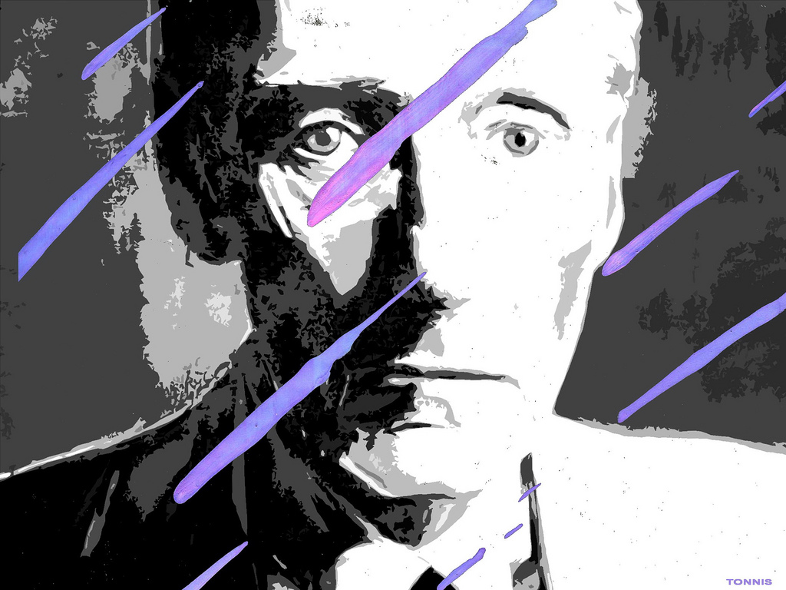

**Уильям Сьюард Берроуз II (Второй, первый создал один из первых коммерческих арифмометров)** (5/02/1914 — 2/08/1997) -- американский писатель 20 века, одна из ключевых фигур контр-культуры, психоделического движения, а заодно ещё и один из первых тульповодов современности, ласково именуемый **Дедушкой Тульповодства**. Известен не только как деятель контр-культуры, но и как писатель, эссеист, художник, Маг Хаоса, гомосексуалист и наркоман. **[СТИ](/theory/fagname)** -- Проектофаг Танжерский, имя тульпы -- Проект.

## Биография в фактах
* Отрезал себе часть мизинца в подростковом возрасте, чтобы впечатлить возлюбленного.
* Сделал весомый вклад в разбазаривание наследства, путешествуя по всяким интересным местам и не работая.
* Проучился до третьего курса меда где-то в Европе, впоследствии много щеголял своими знаниями в области медицины в произведениях.
* Дружил с Керуаком, Алленом Гинзбергом и иными битниками, по сути сформировав бит-движение, предтечу хиппи и одну из самых политизированных и прогрессивных субкультур того времени ((см. "Рюкзачная революция")). Сам себя к битникам не относил.
* Прославился эксплуатацией метода нарезок дадаиста Тристана Тзары - метода написания произведений путём перемешивания готовых кусков и сложения их в новом порядке. Самые рандомные произведения были им написаны в середине творческого пути.
* Ещё прославился зашкаливающим количеством шок-контента, в частности однополых соитий во всех произведениях. Критики утверждают, что это был его способ всколыхнуть читателя. Кроме того, в его произведениях практически нет женщин.
* Основные темы творчества Берроуза - культура индейцев, наркотики, Танжер ((где прожил немало лет)), сексуальность и власть (точнее, Контроль). Политические взгляды Берроуза тяжело поддаются описанию и имеют много общего с индивидуализмом. 
* Несмотря на тотальную гомосексуальность, женился на Джоан Воллмер и заделал с ней сынишку Билли. Позже, упоровшись и набухавшись, решил поиграть с ней в Тилля Уленшпигеля, поставил на голову стакан и метко застрелил. Был оправдан и сильно сожалел о её смерти. Сам Берроуз, как утверждают знакомые, был превосходным стрелком.
* Вместе с художником Гайсином и инженером Соммервилем ((одним из своих любовников, btw)) изобрёл психоактивный стробоскоп, названный "Dream Machine", который стал предком всех остальных современных дрим-машин. Соммервиль погиб в 62ой день рождения Берроуза, разбившись в автокатастрофе.
* Был близким другом Тимоти Лири, который не нуждается в представлении. 
* Практически всю жизнь провёл на опиатах. Бросал их и снова начинал употреблять несколько раз. Пропагандировал лечение апоморфином, теории Вильгельма Райха и боролся с сайентологией. 
* Ему приписывают авторство над семплированной музыкой и киберпанком.
* Увлекался Магией Хаоса, был членом Иллюминатов Танатероса и предположительно тесно общался с Филлипом Хайном, популяризатором Магии Хаоса и сервиторов ((по Хайну сервитор являлся скорее энергороботом, чем личностью)). 
* Последние годы Берроуз провёл в отшельничестве со своими кошками (которых страстно любил) и своим душеприказчиком. 
## Тульповодство
В "Моём Образовании", своём последнем произведении, являющимся сборником снов, Берроуз упоминает сон о встрече с тульпой:
>Домой пораньше... уснуть... и видеть сны?
>
>Вечеринка. Я дома в постели, и кто-то входит. Я вижу сквозь него. Руки у меня дрожат, поэтому не могу хорошо прицелиться. Затем он ложится ко мне в постель.
>
>Чем-то похож на Уэйна. Уже не боюсь. Кто это или что это? Просыпаюсь. Снова засыпаю. 
>
>Вот он опять проходит сквозь полог, закрывающий дверной проем. Ложится ко мне в постель. Встреча смутно сексуальна. Он материален наполовину, я вижу сквозь него, но могу пощупать его, и он оставляет слабый отпечаток на покрывале. На нем серый костюм, тающий на нем. Когда он входит, Рыжая спрыгивает с кровати и выбегает. Я узнаю в нем Проект, наполовину сформированное существо из моих мыслеформ. К этому времени я уже испытываю к нему дружеские чувства. (Он -- тулпа.) 

Из этого короткого отчёта можно судить о том, что Берроуз практиковал своеобразную форму тульповодства, явно качал визуал и испытывал к своей (своему) тульпе определённые чувства, что намекает на тульповодство современного образца. Никакие иные подробности о личности тульпы Берроуза нет. По всей видимости, о тульпах он узнал из книги Александры Давид-Ноэль или у кого-то из своих коллег-хаоситов. Ведутся исследования.

Спустя 20 лет после смерти Уильям Берроуз получил стандартное тульповодское имя - **Проектофаг Танжерский**. 
