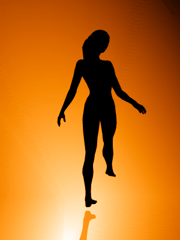
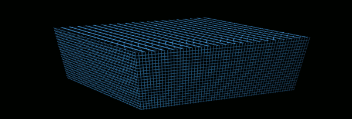
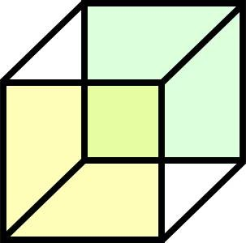

Здесь собраны 3 упражнения для концентрации.

## Упражнение первое
Упражнение заключается в тренировке концентрации с “помехой”.

Необходимые вещи:
- Объект для фокусировки внимания, который представляет интерес.
- Информация, которая имеет не меньший интерес.
- 40 минут на выполнение (Больше - можно, меньше - не желательно)

Объект должен быть таким, чтобы о нём можно было думать в течении длительного промежутка времени. Это может быть свежекупленная вещь. Только не очередное барахло хозяйственного назначения, покупка которого является вынужденной необходимость. Это должно быть то, о чём вы реально желаете. Для нумизматов это будет монета, для кого-то новая фигурка по любимому персонажу, хотя многим людям этой вещью будет новый автомобиль/смартфон/планшет/компьютер/ретро-консоль и т.д. и т.п

Информация нужна для того, чтобы “уравновесить весы”, то, что могло бы “конкурировать” за внимание с вожделенной вещью. Например поставить эту вещь перед телевизором, сесть напротив в любой удобной позе, включить любимый фильм/сериал/передачу и начать концентрироваться на вещь. Моргать можно, закрывать глаза - нет. Можно включить что-то на компьютере, главное - то что будет на экране/мониторе, должно быть вам не менее интересно, чем вещь, на которой вы сосредотачиваете внимание, оно должно вас манить. Крутите в уме мысли о вещи, образы, в которых она фигурирует.

Ничего страшного, если ассоциативный ряд будет уводить вас в подобие сна наяву, главное чтобы в каждом образе и каждой фантазии фигурировала эта вещь. Привносите её туда усилием воли, не упускайте её. О чём бы вы ни думали, вещь должна быть там. Даже если эта вещь - монета, а вы думаете о скорой поездке в Таиланд, представляйте себя в Таиланде с этой монетой в руке. Представляете дождь - пусть это будет дождь из монет. Вещь должна стать "красной нитью", проходящей через все ваши мысли, ваши наваждением.

Естественно, от раза к разу вещь желательно менять. Ведь если вы будете каждый раз думать об одной и той же, она вам скоро надоест и ваш интерес к ней ослабнет. Если у вас всего две интересных вещи, используйте их поочерёдно. Если одна - раздобудьте вторую.

### Как совместить это упражнение + форсинг?
Для тульпофорсера можно купить любую вещь связанную с вашей тульпой. Это может быть фигурка, дакимакура с принтом вашей тульпы или вещь,  на которой есть изображение вашей тульпы. Можно использовать также предмет, с которым у вас ассоциируется сама тульпа.

Если же денег нет, то можно просто взять свой смартфон, открыть "изображение" с тульпой, не забыв при этом поменять настройку времени "активности" экрана.
Если же имеются прямые руки с сфере рисования/скульптур/ещё какого-либо творчества - то можно самому нарисовать/слепить тульпу и так далее (этот вариант идеально подойдёт для тех, у кого моделька тульпы собственноручно созданная).

Остальное всё так же, как и в упражнении.

## Упражнение второе
Упражнение заключается в выборочной фокусировке внимания на произвольной акустической информации.

Необходимые вещи:
- Научится уверенно выполнять первое упражнение.
- Компьютер с колонками или же радио + телевизор + телефон/радио.

Для этой цели подойдет компьютер с колонками, если вы в состоянии настроить запуск нескольких музыкальных проигрывателей одновременно. Нужно, чтобы несколько музыкальных треков воспроизводилось параллельно. Минимальное количество одновременных треков - 3.

Если вы не можете справиться с компьютером, воспользуйтесь радио. Минимальное число станций всё то же - 3. Включите радио, а на телевизоре - музыкальный канал. Третьим источником может выступать телефон, на них сейчас на всех гарнитура может использоваться как FM антенна. Как вариант, можно включить на компьютере 3 станции интернет-радио, если вам позволяет ширина канала.

Громкость всех источников должна быть одинаковой, а их содержимое приблизительно интересным для вас.

Музыкальный трек не может составить для вашего внимания конкуренцию выпуску новостей. Соперничать может только однотипный контент - музыка с музыкой, новости с новостями.

Ваша задача выцеживать из звуковой каши конкретную информацию, выделяя её на общем фоне. Переключать внимание с трека на трек, с одних новостей на другие, и произвольно долго удерживать внимание на выбранном потоке.

Начинать лучше с музыки или записи каких-то спокойных звуков, после чего постепенно повышать сложность, переходя на танцевальную, хоровую, а затем и на новости.

При прыжках со станции на станцию запоминайте содержимое предыдущих новостей и вспоминайте его при прослушивании последующих. Это важно, чтобы вы могли ориентироваться в несущем вас потоке. Вы не должны ощущать себя щепкой в бурной реке. Вы должны ощущать себя тренирующимся в бассейне олимпийским чемпионом по плаванию.

## Упражнение третье
Упражнение заключается в выборочной фокусировке внимания на одном из двух образов, воспринимаемых вниманием одновременно.

Необходимые вещи:
- Уверенное выполнение первых двух упражнений

Ниже находятся два динамических изображения вращающихся объектов. Фокус в том, что на самом деле изображений четыре, потому что каждое совмещает в себе два, демонстрирующихся одновременно. Мозг здорового человека сконфигурирован на выборку только одного единственно возможного варианта, и не в состоянии принимать больше. Либо один вариант, либо другой. На этом и построены данные иллюзии.

В какую бы сторону вращение ни происходило конкретно для вас - влево или вправо, это не меняет того факта, что вращение происходит в обе стороны одновременно. Вы должны научиться усилием воли заставлять ваш мозг переключаться с одного варианта на другой. Это сложно, требует практики. Не пытайтесь жульничать, зажмуривая глаза или отворачиваясь. Смотрите прямо в центр изображения и любым доступным вашему сознанию способом заставьте себя увидеть другой вариант.

Посмотрите на этот куб. Что вы видите?

Здесь два куба. У одного куба передняя сторона - жёлтая, а у другого - зелёная. Но чтобы изображение имело смысл, наш мозг выбирает только один куб. Тот же принцип используется в динамических иллюзиях выше. Так же, как вы можете выбрать один вариант здесь, вы можете сделать это и там.

## Ссылки
* [Источник](https://docs.google.com/document/d/1RcW1cQfxFnasvJrySUm2pd-7VxPWKT5jRoAbiVuejx4/view)
